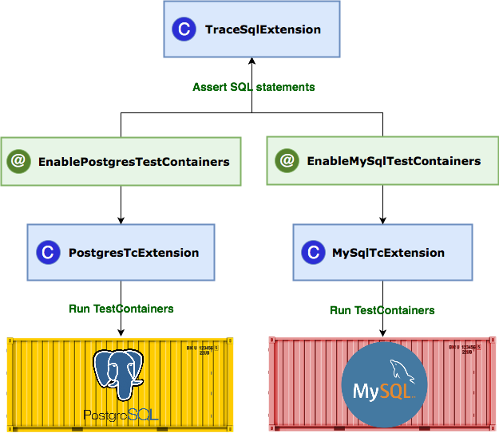
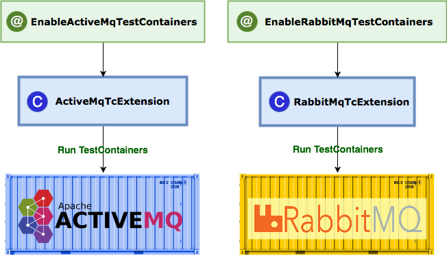
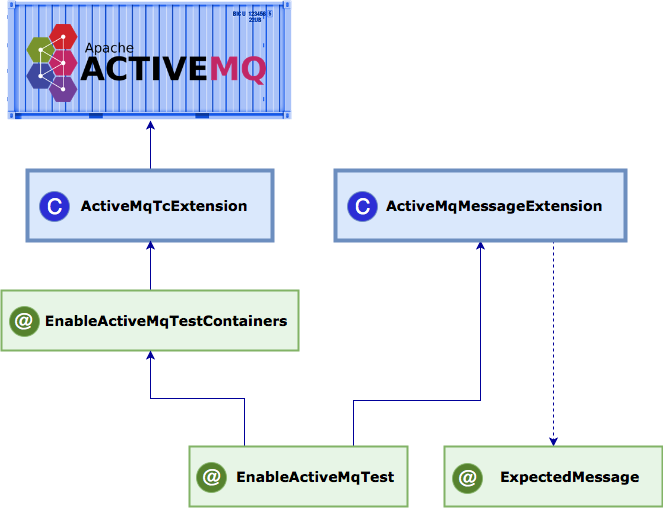
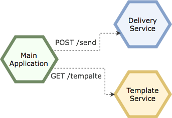

:toc: preamble

# JUnit5 Spring Boot Extensions

image:https://travis-ci.com/jupiter-tools/spring-boot-extensions.svg?branch=master["Build Status", link="https://travis-ci.com/jupiter-tools/spring-boot-extensions"]
image:https://codecov.io/gh/jupiter-tools/spring-boot-extensions/branch/master/graph/badge.svg[link ="https://codecov.io/gh/jupiter-tools/spring-boot-extensions"]

## Database specific tests

### TraceSql Extension

Provide you an ability to check SQL statement execution after tests.

For example, you can assert a count of insert operations after save an entity:

[source, java]
----
@ExtendWith(TraceSqlExtension.class)
@ExtendWith(SpringExtension.class)
@SpringBootTest
class TraceSqlExtensionTest {

    @Autowired
    private FooRepository fooRepository;

    @Test
    void testInsert() {
        // Act
        fooRepository.save(new Foo("any data"));
        // Assert
        AssertSqlCount.assertInsertCount(1);
    }
}
----

### PostgreSQL Extension

To run the docker postgres image by the test-containers library
in your integration test, you can use PostgresTcExtension:

[source, java]
----
@DataJpaTest
@ExtendWith(SpringExtension.class)
@ExtendWith(PostgresTcExtension.class)
@ExtendWith(TraceSqlExtension.class)
@AutoConfigureTestDatabase(replace = AutoConfigureTestDatabase.Replace.NONE)
class PostgresTcExtensionTest {

    @PersistenceContext
    private EntityManager entityManager;

    @Test
    @Sql("/stored_functions/test_func.sql")
    void testStoredFunc() {
        // Arrange
        StoredProcedureQuery query = entityManager.createStoredProcedureQuery("rnd");
        // Act
        query.execute();
        // Assert
        List resultList = query.getResultList();
        int rnd = (int) resultList.get(0);
        Assertions.assertThat(rnd).isEqualTo(123);
    }
}
----

This library provides a wide system of meta-annotations to
simplified writing integration test's configuration.

For example, you can write:

[source, java]
----
@EnablePostgresDataTest
class EnablePostgresDataTestTest {
    ...
}
----

instead of:

[source, java]
----
@DataJpaTest
@ExtendWith(SpringExtension.class)
@ExtendWith(PostgresTcExtension.class)
@ExtendWith(TraceSqlExtension.class)
@AutoConfigureTestDatabase(replace = AutoConfigureTestDatabase.Replace.NONE)
class PostgresTcExtensionTest {
    ...
}
----

you can see at whole postgres annotation system at the next picture::

image:./images/pg-annotations.png[postgres annotation system]

You can build a necessary test configuration by using annotations which you need. Meta-annotations is a beautiful mechanism which will you a making configuration in a declarative style.

### MySql Extension

MySqlTcExtension runs the mysql docker image and set spring properties
in the configuration to use this datasource in tests.

You can use this extension by the applying of `EnableMySqlTestContainersExtension` annotation or
you can use `@EnableMySqlDataTest` to write a test with the DataJpa context configuration:

[source, java]
----
@EnableMySqlDataTest
class EnableMySqlDataTestTest {

    @Autowired
    private FooRepository repository;

    @Test
    @Commit
    @DataSet(cleanBefore = true, cleanAfter = true)
    @ExpectedDataSet(value = "/datasets/expected.json", ignoreCols = "ID")
    void testCreate() throws Exception {
        repository.saveAndFlush(new Foo("any data"));
    }
}
----

As well as for the PostgreSQL in this library there is a system of meta-annotations for the MySql:

image:./images/mysql-annotations.png[mysql annotation system]

## Messaging systems

### RabbitMq Extension

`RabbitMqTcExtension` runs the RabbitMq docker image by the TestContainers library
and configure SpringBoot properties to work with this container.

[source, java]
----
@SpringBootTest
@ExtendWith(SpringExtension.class)
@ExtendWith(RabbitMqTcExtension.class)
class EnableRabbitMqTestTest {

    @Autowired
    private AmqpTemplate amqpTemplate;

    @Test
    void testSend() {
        amqpTemplate.convertAndSend("test-queue", "123");
        ...

    }
}
----

As well as with database specific tests, in this case, you can use meta-annotation to write tests more pragmatic:

[source, java]
----
@EnableRabbitMqTest
class EnableRabbitMqTestTest {
   ...
}
----

Also, you can assert the sending of messages in the selected queue:

[source, java]
----
@EnableRabbitMqTest
public class ExpectedMessageTest {

    @Autowired
    private AmqpTemplate amqpTemplate;

    @Test
    @ExpectedMessage(queue = "test-queue", message = "123")
    void testSend() throws InterruptedException {
        amqpTemplate.convertAndSend("test-queue", "123");
    }
}
----

### ActiveMq Extension

You can run the ActiveMq docker image by the using of `EnableActiveMqTestContainers` annotation.

If you need to check a sending of messages then you can use the `ExpectedMessage` annotation:

[source, java]
----
@SpringBootTest
@EnableActiveMqTest
public class SendMessageTest {

    @Autowired
    private JmsTemplate jmsTemplate;

    @Test
    @ExpectedMessage(queue = "test-queue", message = "123")
    void testSend() {
        jmsTemplate.convertAndSend("test-queue", "123");
    }

    @TestConfiguration
    public static class TestConfig {
        @Bean
        public Queue testQueue() {
            return new Queue("test-queue");
        }
    }
}
----

## Embedded Web Server

Let's consider the next microservice based application:

You can test inter-service communication by the running an embedded
web server with a mocked external controller and send HTTP requests to this server.

[source, java]
----
@EnableEmbeddedWebServerTest
@RedirectRibbonToEmbeddedWebServer("template-service")
class RedirectRibbonExtensionTest {

    @Autowired
    private RestTemplate restTemplate;

    @Test
    void testRedirect() {
        // Act
        String result = restTemplate.getForObject("http://template-service/templates/{template}",
                                                String.class,
                                                "balance-template");
        // Assert
        assertThat(result).isEqualTo("{user} balance = {value}");
    }

    @TestConfiguration
    public static class TestCfg {

        @Bean
        @LoadBalanced
        public RestTemplate restTemplate() {
            return new RestTemplate();
        }

        @RestController
        @RequestMapping("/templates")
        public class TestApi {

            @GetMapping("/{template}")
            public String getLength(@PathVariable("template") String template) {
                return "{user} balance = {value}";
            }
        }
    }
 }
----

If you want to run different web servers in one test suite
then you need to use a different port to each server.
And you need to be sure that selected port is available.

Annotation `EnableEmbeddedWebServerTest` bind a random available TCP port to the server.port property of the Spring Framework.

Also, if you use `RedirectRibbonToEmbeddedWebServer("template-service")` then all requests to
selected ribbon clients (`template-service`) send to the embedded web server.

`RedirectRibbonToEmbeddedWebServer` redirects all requests from any ribbon
clients to embedded server, by default (if you don't set the value of this annotation).
